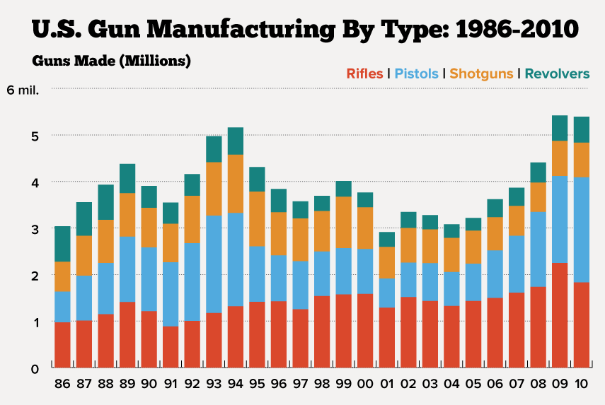
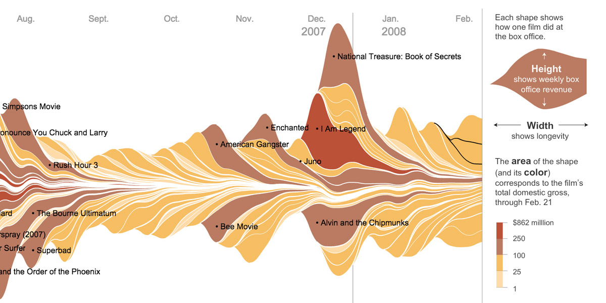
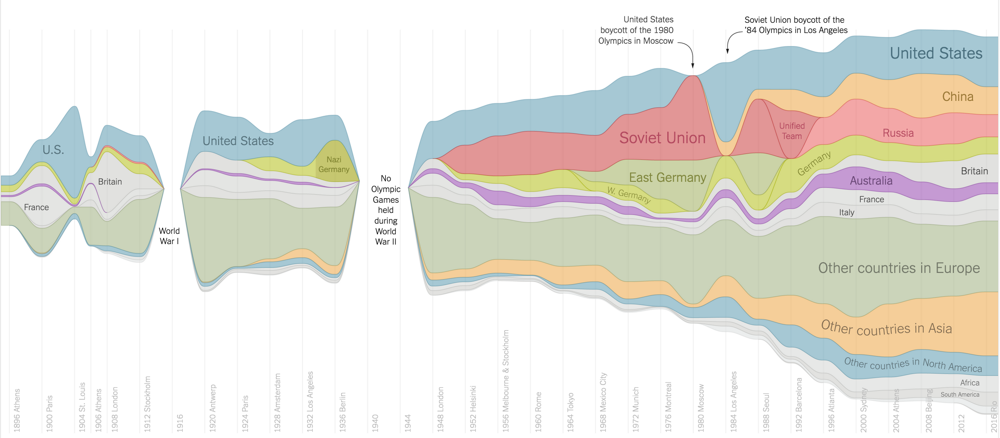

# Displaying Time-Series Data

## Limitations of Stacked Graphs

Visualizing a quantity that varies over time and is composed of more than two or three sub-segments is no simple task. For example, the following stacked bar chart of [U.S Gun Manufacturing by Type between 1986 and 2010](http://thedailyviz.com/2012/08/07/charting-u-s-gun-manufacturing/) allows us to clearly track the number of rifles manufactured over time, as the category is placed at the bottom of the chart. However, it is a lot more difficult to assess the change in the number of shotguns produced in America throughout the years  given that the separated bars, coupled with the uneven positioning, makes it hard to quickly grasp the changes from year to year.

<br>



<br>

The  main  idea  behind a stacked graph (including __stacked bar graphs__ and __stacked area charts__) follows  Tufte’s  macro/micro principle: to show as many individual time series while also conveying their sum. Given that the heights of the individual layers add up to the height of the overall graph, it is possible to satisfy both goals at once. But, as in the example above, this involves certain trade-offs. 

<br>

* There can be no spaces between layers, as this would prevent us from accurately calculating the total for each time period. As a consequence, any change in a middle layer will necessarily result in shifts up or down in all layers above it. 
* Two layers of the same vertical height, but with different slopes (different starting position) may appear to have different magnitudes, adding an extra level of complexity to reading and comparing the various layers over time. 
* Depending on the data, stacked graphs could end up being too 'flat' or too 'spiky'.
* In graphs with many categories, it may be hard for the reader to distinguish the different layers, especially those of smaller magnitude. 
* While stacked area charts improve the ability to see trends over time when compared to stacked bar graphs, it is still only possible to accurately interpret changes in the bottom category and total changes over time. 

<br>

In essence: __it is difficult to compare the heights of any of the layers except for the bottom layer__. 

<br>

## Streamgraphs: A Viable Alternative

An increasingly popular and aesthetically pleasing solution for displaying time series data is the use of __streamgraphs__, which connect categories together into continuous polygons that are generally aligned to the middle to prevent one category from getting favored status (as is the case with stacked bar graphs and area charts). 

<br>

### Popular Examples 

One of the best known examples of a streamgraph is [The Ebb and Flow of Movies](http://archive.nytimes.com/www.nytimes.com/interactive/2008/02/23/movies/20080223_REVENUE_GRAPHIC.html?_r=1), published by the New York Times in 2008. The interactive visualization, depicted below, shows the box office receipts of all major commercial films released between 1986 and 2007. Each film’s financial returns are rendered in a wave on a timeline, from which can be deduced its total box office haul, its longevity in theaters and the speed of decline in its ticket sales. In addition, the graph offers insight into how release patterns have changed in the past decades, highlighting the importance of opening weekend profits in the financial performance of a movie, and the changes in movie shelf life over time (the shortening of the wave forms over the sampled period shows that the shelf life of more recent movies is shorter than it was twenty years ago). 

<br>



<br>

A more recent example, [A Visual History of Which Countries Have Dominated the Summer Olympics](https://www.nytimes.com/interactive/2016/08/08/sports/olympics/history-olympic-dominance-charts.html), also published by the New York Times in 2016. The static visualization not only tracks the number of medals per country over time, but also portrays a "a snapshot of modern history: "The world pauses for war; countries rise, fall and acquire new names; the United States and the Soviet Union grow in strength during the Cold War; China emerges as a global player".  The publication further explores patterns in individual events, with streamgraphs tracking the medals by country for each discipline and providing further insight into more concentrated efforts from fewer nations and demonstrating that sport specialization tends to be the rule, not the exception. 

<br>



<br>

It is important to note that, in both these examples, __the actual numbers are not really the main point of interest, it is the patterns, the ebb and flow, and the relative magnitude of each category, that are important__. With its flowing, organic shape, streamgraphs can be great at depicting such patterns in an engaging manner. 

<br>

### Definition 

<br>

> "Streamgraphs are a generalization of stacked area graphs where the baseline is free. By shifting the baseline, it is possible to minimize the change in slope (or wiggle) in individual series, thereby making it easier to perceive the thickness of any given layer across the data." - Lee Byron

<br>

Streamgraphs are useful in __representing the evolution of a numeric variable for several groups/categories__. 

Their layout emphasizes legibility of individual layers by arranging them around a varying central baseline, instead of a fixed straight axis, with rounded edges that give the graph a flowing shape and make it aesthetically pleasing and more engaging to look at. 

In a streamgraph, __the size of each individual shape is proportional to the values of each category__. The X-axis is used for the timescale, with each tick indicating a specified time interval in months, days, or years, and the Y-axis displays the count. Colors can be used to either distinguish each category or visualize each category's additional quantitative values through varying color shades. 

As explored with the examples above, streamgraphs are ideal for displaying time series data and are particularly useful in allowing us to discover trends and patterns over time across a wide range of categories. For example, seasonal peaks and troughs in the stream shape can suggest a periodic pattern. 

<br>
 
While streamgraphs address some of the weaknesses of stacked bar graphs, they have the following limitations: 

* They can get cluttered with large datasets. 
* The categories with smaller values are often 'drowned out' by categories with larger values, making it hard to see all the data.
* Given that it does not use a fixed X-axis, it is hard to extract the exact value of each category at a given point in time.

<br>

Therefore, streamgraphs should be used to provide the viewer/reader with a general outlook of the patterns in the data.They also tend to work significantly better as an interactive piece rather than a static or printed graphics given that the user can hover over any point in the graph and see the magnitude of that category at a given point. 

<br>

__You can easily make interactive streamgraphs in R with the `streamgraph` package.__


# The streamgraph htmlwidget R Package

<br>

The streamgraph package is an `htmlwidget` that is based on the `D3.js` JavaScript library. 

## Installation
`devtools::install_github("hrbrmstr/streamgraph")`

## Usage

You create streamgraphs with the `streamgraph`function, which takes three inputs: `key`, `value`, and `date`.
<br>

* `date`: The current version of the package calls for a date based X-axis particularly, but will perform the necessary conversions for the underlying D3 processing when years are given as an input. 

* `key`: As streamgraphs display categories in the area regions, the data needs to be in [long format](http://blog.rstudio.org/2014/07/22/introducing-tidyr/) which can be easily achievable using `dplyr` and `tidyr`.

* `value`: The variable we are counting (ex. number of medals, movie revenue, etc.)

* You can add a legend to the streamgraph, which allows you to select a category, which then gets highlighted in the graph. This allows for easier legibility of the different layers. 

* Given the interactive nature of the rendering, you can hover over any point in the graph and it will tell you the category and the magnitude for the particular time period. 


The following example explains how to produce a streamgraph from the ggplot2 movies data set.

```{r setup, include=FALSE}
knitr::opts_chunk$set(echo = TRUE)

library(dplyr)
library(tidyr)
library(ggplot2movies)
library(streamgraph)

brazil_fires <- read.csv('brazil_forest_fires.csv', encoding="latin1", stringsAsFactors=FALSE)
```


```{r ggplot2movies}
# Defining a Colorblibd-friendly palette 
cbPalette <- c("#999999", "#E69F00", "#56B4E9", "#009E73", "#F0E442", "#0072B2", "#D55E00", "#CC79A7")

ggplot2movies::movies%>% 
  #Select desired columns
  select(year, Action, Animation, Comedy, Drama, Documentary, Romance, Short) %>%
  #Converting to long format
  gather(genre, value, -year) %>% 
  #Grouping by year and genre
  group_by(year, genre) %>%
  #Counting the number of movies by year, by gender
  tally(wt=value) %>%
  ungroup %>%
  #Creating the streamgraph
  streamgraph("genre", "n", "year",
              width = "950", height = "500") %>%
  #Setting ticks every 20 years
  sg_axis_x(20) %>%
  #Use the color palette defined above
  sg_fill_manual(cbPalette) %>%
  #Adding a legend to select and highlight genres
  sg_legend(show=TRUE, label="Genres: ")

```

<br>

The default behavior of the streamgraph function is to have the graph centered in the y-axis, with smoothed “streams”. When defining the streamgraph, you can specify `offset`= "zero"" to set a fixed x-axis starting at 0 (looks like a stacked area graph), and `interpolate`="linear" for pointier edges. 

## Visualizing Forest Fires in Brazil with Streamgraphs 

### Context
<br>

>"As the world's largest rainforest, the Amazon plays a crucial role in keeping our planet's carbon-dioxide levels in check. Plants and trees take in carbon dioxide and release oxygen back into the air in their process of photosynthesis. This is why the Amazon, which covers 2.1 million square miles, is often referred to as the lungs of the planet: The forest produces between 6% and 20% of the oxygen in our planet's atmosphere".

In 2019, Brazil has experienced more than 76,000 fires, nearly double the 2018 total of 40,000. Most of the fires in Brazil are deliberately started by humans; farmers and loggers purposefully set fire to the rain forest during certain months to clear large areas for industrial or agricultural use. Hence, forest fires tend to be closely linked to deforestation in the world's largest rain forest. Data from [Brazilian satellites](http://terrabrasilis.dpi.inpe.br/app/dashboard/alerts/legal/amazon/aggregated/#),indicated that about three football fields' worth of Amazonian trees fell every minute during the month of July, which was 39% higher from last year's rate the same month. 


### Data

<br>
The Brazilian government publishes open data [data](http://dados.gov.br/dataset/sistema-nacional-de-informacoes-florestais-snif) on the number of forest fires per state, per year. The latest dataset covers a period of approximately 10 years (1998 to 2017). With this data, it is possible to assess the evolution of fires over the years as well as the regions where they were concentrated. 
<br>

For the purpose of this example, we will focus on the subset of states comprising the Amazon forest: Acre, Amapá, Pará, Amazonas, Rondonia, Roraima, and part of Mato Grosso, Tocantins, and Maranhão.
<br>

```{r fires}
#Data cleaning for the streamgraphs

#List of Amazon states 
amazon_states <- c("Acre","Amapa","Pará", "Amazonas","Rondonia", "Mato Grosso","Tocantins","Maranhao")

brazil_fires<- brazil_fires%>% 
  #Dropping Date Column
  select(-c(date))%>%
  #Keeping only states comprising Amazon forest 
  filter(state %in% amazon_states)%>%
  #Changing months from Portuguese to English 
  mutate(month= recode(month,Janeiro= 'January', Fevereiro= 'February', Março= 'March', 
                       Abril= 'April', Maio= 'May',Junho= 'June', Julho= 'July', 
                       Agosto= 'August', Setembro= 'September', Outubro= 'October',
                       Novembro= 'November', Dezembro= 'December'))%>%
  #Changing months to numeric 
  mutate(month= recode(month,January= 1, February= 2, March= 3, April= 4, May= 5,
                       June=6, July=7, August=8, September=9, October= 10,
                       November= 11, December= 12))
```

<br>

### Streamgraphs

<br>

To observe general trends over time, we will first plot a streamgraph depicting the number of forest fires per state in the last five years of the dataset (2013-2017). We could also plot a graph including all years, but for the purpose of this example, five years will allow us to have a readable plot without needing a sidebar or being too cluttered. From the graph below, we can tell that forest fires seem to be a cyclical phenomenon in Brazil; with some months having close to zero fires, and others having a much larger count. By highlighting the different states using the legend we can tell that, of the states comprising the Amazon rain forest, Mato Grosso has the highest number of fires. 
<br>
```{r 13_17}
# Processing data for plotting 
brazil_fires_13_17<- brazil_fires%>% 
  #Kepping only 5 years
  filter(year %in% c(2013, 2014, 2015, 2016, 2017))%>%
  #Joining month and year -need to add '-01' to make it a valid date for streamgraph
  mutate(yearmonth= as.Date(paste(year,month, "01", sep="-"),"%Y-%m-%d"))%>%
  #Group by year-month and state
  group_by(yearmonth, state)%>%
  #Sum Forest Fires
  summarise(num_fires = sum(number))


# Creating streamgraph
streamgraph(data = brazil_fires_13_17, key = "state", value = "num_fires", date = "yearmonth",
                  offset = "silhouette", interpolate = "cardinal",
                  width = "950", height = "550") %>%
  sg_legend(TRUE, "State: ") %>%
  sg_fill_manual(cbPalette) %>%
  sg_axis_x(tick_interval = 1, tick_units = "year", tick_format = "%Y") 

```

<br>

In order to have a closer look at the trends, we can plot two streamgraphs over a one and a two year interval (2016-2016, and 2017 respectively), with the X-axis showing months rather than years. These plots allow us to see that forest fires significantly decrease after June, and start escalating again in September/October, peaking in November. Additionally, we can see that fires tend to occur at different times in different states, while some states seem to have some fires every month. For instance, the state of Ampa experiences fires between August and December, Maranhao in May and June, Acre in June and July, Para between January and June, while Mato Grosso appears to experience fires year-round at varying degrees. 

<br>

```{r 16_17}
# Processing data for plotting 
brazil_fires_16_17<- brazil_fires%>% 
  #Kepping 2016-2017
  filter(year %in% c(2016,2017))%>%
  #Joining month and year -need to add '-01' to make it a valid date for streamgraph
  mutate(yearmonth= as.Date(paste(year,month, "01", sep="-"),"%Y-%m-%d"))%>%
  #Group by year-month and state
  group_by(yearmonth, state)%>%
  #Sum Forest Fires
  summarise(num_fires = sum(number))

# Create streamgraph
streamgraph(data = brazil_fires_16_17, key = "state", value = "num_fires", date = "yearmonth",
                   offset = "silhouette", interpolate = "cardinal",
                   width = "1000", height = "550") %>%
  sg_legend(TRUE, "State: ") %>%
  sg_fill_manual(cbPalette) %>%
  sg_axis_x(tick_interval = 1, tick_units = "month", tick_format = "%Y-%m")
```

<br>

```{r 17}
# Processing data for plotting 
brazil_fires_17<- brazil_fires%>% 
  #Kepping only 2017
  filter(year %in% c(2017))%>%
  #Joining month and year -need to add '-01' to make it a valid date for streamgraph
  mutate(yearmonth= as.Date(paste(year,month, "01", sep="-"),"%Y-%m-%d"))%>%
  #Group by year-month and state
  group_by(yearmonth, state)%>%
  #Sum Forest Fires
  summarise(num_fires = sum(number))

# Create streamgraph
streamgraph(data = brazil_fires_17, key = "state", value = "num_fires", date = "yearmonth",
                  offset = "silhouette", interpolate = "cardinal",
                  width = "1000", height = "550") %>%
  sg_legend(TRUE, "State: ") %>%
  sg_fill_manual(cbPalette) %>%
  sg_axis_x(tick_interval = 1, tick_units = "month", tick_format = "%Y-%m")

```

<br>

### Limitations of the streamgraph package 

While the `streamgraph` package produces interactive graphs in a few simple steps, you must be aware of the following limitations:

* It is not possible to add axis labels of plot title 
* The size of the widget has to be fixed when creating the plot; it will not scale automatically. 
* While you can change the dimensions of the plot, it is not possible to change the font size, making it difficult to read in general and specially when rendering larger plots.


